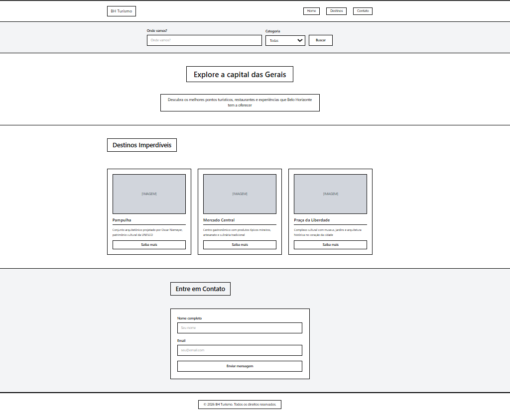
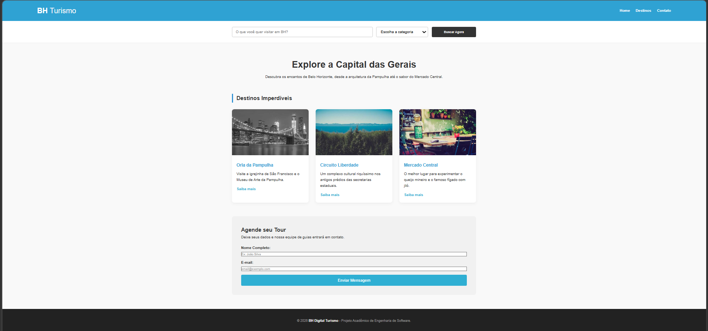

# Projeto: BH Digital Turismo - Turismo em Belo Horizonte

## 1. Dados Básicos
* **Nome:** [Aiandra de Sousa Silva]
* **Matrícula:** [906626]
* **Proposta de Projeto:** Proposta 2 - Lugares e Experiências.
* **Breve Descrição:** Aplicação web profissional que apresenta os principais roteiros turísticos de Belo Horizonte. O site utiliza de estrutura semântica HTML5, estilização moderna com CSS (Flexbox/Grid), barra de pesquisa funcional e formulário de contato para agendamento de tours.

---

## 2. Imagem do Esboço (Wireframe)

---

## 3. Print da Home-page Criada
